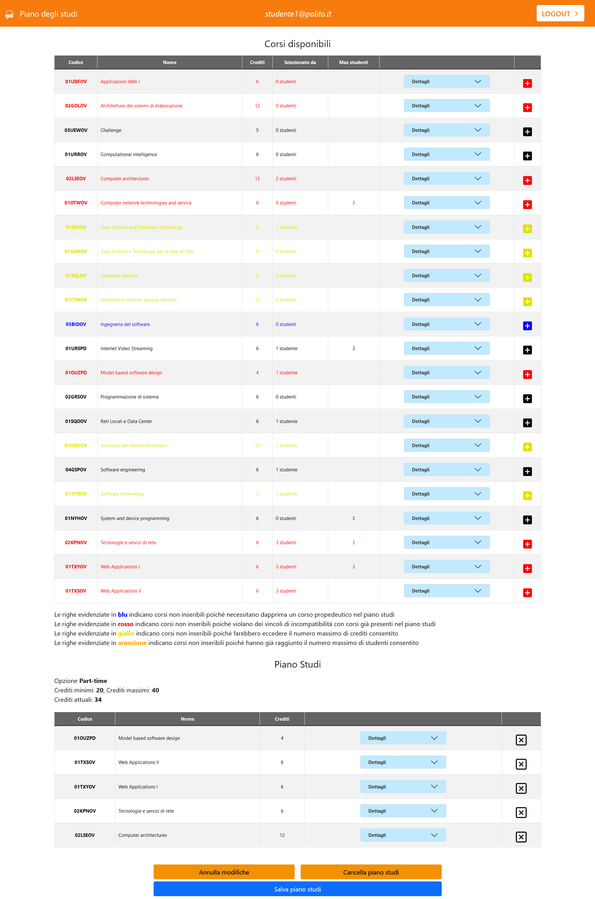

# Exam #1: Piano Studi
## Student: s303398 CIRAVEGNA FLAVIO 

## React Client Application Routes

- Route `/`: main page, for not authenticated user
- Route `/studenthome`: page for the authenticated user (student)
- Route `/login`: page where the user can perform the login

## API Server

### Get list of all courses
* HTTP method: `GET`  URL: `/api/courses`
* Description: Get list of all courses, for all users
* Request header parameter: _None_
* Request body: _None_
* Response: `200 OK` (success)
* Response body: *Array of courses*:

``` JSON
[{
    "codice": "02GOLOV",
    "nome": "Architetture dei sistemi di elaborazione",
    "crediti": 12,
    "maxstudenti": null,
    "proped": null,
    "incomp": [ "02LSEOV" ],
    "selectedby": 0
  },
  ...
]
```
* Error responses: `500 Internal Server Error` (generic error)

### Get list of study plan courses
* HTTP method: `GET`  URL: `/api/courses/studyplan`
* Description: Get list of study plan courses, for logged users
* Request header parameter: _None_
* Request body: _None_
* Response: `200 OK` (success)
* Response body: *Array of IDs*:
``` JSON
[ "01TYDOV", "01NYHOV", "02KPNOV", "01TXYOV" ]
```
* Error responses:  `401 Unauthorized` (not logged in or wrong permissions), `500 Internal Server Error` (generic error)

### Save the study plan
* HTTP method: `POST`  URL: `/api/courses/studyplan`
* Description: Save the study plan, for logged users (if the study plan does not exists)
* Request header parameter: _None_
* Request body:
*A JSON object that contains: an array of the ID of the selected courses, isFulltime: [1 = full-time, 0 = part-time]*
``` JSON
{ "selectedCourses": [ "01TYDOV", "01NYHOV", "02KPNOV", "01TXYOV" ], "isFulltime": 0}
```
* Response: `200 OK` (success)
* Response body: *None*
* Error responses:  `401 Unauthorized` (not logged in or wrong permissions), `422 Unprocessable Entity` (validation failed), `503 Service Unavailable` (generic error)

### Update the study plan
* HTTP method: `PUT`  URL: `/api/courses/studyplan`
* Description: Save the study plan, for logged users (if the study plan already exists)
* Request header parameter: _None_
* Request body:
*A JSON object that contains: an array of the ID of the selected courses, isFulltime: [1 = full-time, 0 = part-time]*
``` JSON
{ "selectedCourses": [ "01TYDOV", "01NYHOV", "02KPNOV", "01TXYOV" ], "isFulltime": 0}
```
* Response: `200 OK` (success)
* Response body: *None*
* Error responses:  `401 Unauthorized` (not logged in or wrong permissions), `422 Unprocessable Entity` (validation failed), `503 Service Unavailable` (generic error)

### Delete study plan
* HTTP method: `DELETE`  URL: `/api/courses/studyplan`
* Description: Delete study plan of the logged user
* Request header parameter: _None_
* Request body: _None_
* Response: `200 OK` (success)
* Response body: _None_
* Error responses:  `401 Unauthorized` (not logged in or wrong permissions), `503 Service Unavailable` (generic error)

### Get user info
* HTTP method: `GET`  URL: `/api/sessions/current`
* Description: check whether the user is logged in or not
* Request header: _None_
* Response: `200 OK` (success)
* Response body: *None*
* Error responses:  `401 Unauthorized` (not logged in or wrong permissions)

### Login
* HTTP method: `POST`  URL: `/api/sessions`
* Description: Login
* Request header parameter: _None_
* Request body: *JSON with user credentials (username and passoword)*
``` JSON
{
    "username": "studente1@polito.it",
    "password": "password"
}
```
* Response: `200 OK` (success)
* Response body: JSON with user informations
``` JSON
{
    "id": 1,
    "username": "studente1@polito.it",
    "fulltime": 0
}
```
* Error responses: `500 Internal Server Error` (generic error), `401 Unauthorized` (not logged in or wrong permissions)

### Logout
* HTTP method: `DELETE`  URL: `/api/sessions/current`
* Description: Logout
* Request header parameter: _None_
* Request body: _None_
* Response: `200 OK` (success)
* Response body: _None_


## Database Tables

- Table `corsi` - contains the columns *codice* (primary key), *nome* , *crediti*, *maxStudenti*, *codiceCorsoPropedeutico*.<br/> The fields *codice*, *nome*, *crediti* are *not null*.
- Table `studenti` - contains the columns *id* (primary key), *username* , *password*, *fulltime*, *salt*.<br/> All the fields are *not null*.
- Table `corso-non-compatibile-con` - contains the columns *codice* (references **corsi (codice)**), *codiceNonCompatibile* (references **corsi (codice)**)<br/> The primary key is composed by the columns *codice* and *codiceNonCompatibile*. All the fields are *not null*.
- Table `studente-seleziona-corso` - contains the columns *idStudente* (references **studenti (id)**), *codiceCorso* (references **corsi (codice)**).<br/> The primary key is composed by the columns *idStudente* and *codiceCorso*.<br/> All the fields are *not null*.

## Main React Components

* **CourseList** (in 'components/CourseList/CourseList.js'): this is the component that wraps the main course table and other components, such as the Form (and related buttons) to create a study plan, the tables that contains the selected courses and the buttons to delete/save the plan (and delete modifications). There are other minor components, such as success, error, waiting and loading messages. If the user is not logged in, it shows only the courses table, the title and the navbar.
* **CourseNavbar** (in 'components/CourseNavbar/CourseNavbar.js'): is the navbar of the application. If the user is not authenticated, in the right side there is a login icon (next to the "Login" label) that, if clicked, redirects the user to the login form. That icon changes (becoming a logout icon) if the user is logged in and - in that case - if clicked the user logs out. It can also show the username of the authenticated student.
* **CourseTable** (in 'components/CourseTable/CourseTable.js'): this component returns a table of courses. It can return two kind of tables: the "main" one that shows even if the user is not authenticated, and the one related to the study plan. These two different tables are two "internal" minor components (CreateCourseTable, CreateStudyPlanTable).
* **CourseRow** (in 'components/CourseRow/CourseRow.js'): this component represents one row of a table. Its color can be different than "black", depending on the current study plan. It has also a component (DropDownDetails) that, if clicked, shows the details (incompatible and propedeutic courses of the course associated to that row). It contains the button to add/remove the course to the plan.
* **Login** (in 'components/Login/Login.js'): this component is a classic login form. There are two buttons, one to submit the credentials and one to come back to the home page. The credentials can be submitted also pressing the "Enter" key. It can also show error messages, if needed.

The other components (not listed here) are only minor ones, as error messages or other kind of notification for the user, or details that can appear or not, depending on the current states.

## Screenshot



## Users Credentials

- username: *studente1@polito.it*, password: *password* (part-time)
- username: *studente2@polito.it*, password: *password* (full-time)
- username: *studente3@polito.it*, password: *password* (part-time)
- username: *studente4@polito.it*, password: *password* (nessun piano studi)
- username: *studente5@polito.it*, password: *password* (nessun piano studi)
